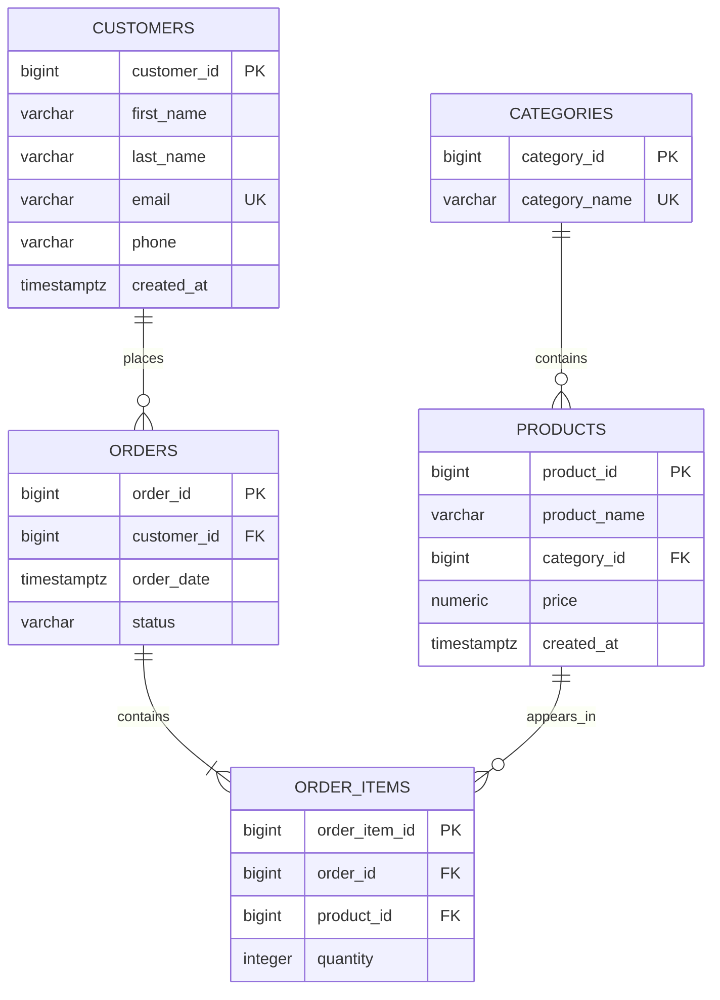

# ShopFlow — E-Commerce Database & Analytics System

A PostgreSQL-based e-commerce database and analytics project designed to demonstrate **relational database design, SQL analytics, window functions, indexing, query optimization, and performance testing**.

ShopFlow simulates an e-commerce platform containing customers, orders, products, categories, and order items. The project then uses PostgreSQL to answer business-oriented analytical questions and investigate how different indexing strategies affect query performance.

---

## 📌 Project Overview

ShopFlow was built as a hands-on PostgreSQL project to move beyond basic SQL queries and work with a larger relational dataset.

The database contains:

* **10,000 customers**
* **100,000 orders**
* **400,000 order items**
* **6 products**
* **5 product categories**

The project covers the workflow of:

```text
Database Design
      ↓
Schema Creation
      ↓
Synthetic Data Generation
      ↓
Indexing
      ↓
SQL Analytics
      ↓
Query Optimization
      ↓
Performance Testing
```

The goal was to build something that demonstrates not only the ability to write SQL, but also the ability to design a relational database, analyze transactional data, and investigate database performance.

---

# 🗂️ Entity Relationship Diagram

The database follows a relational structure connecting customers to orders, orders to order items, products to order items, and products to categories.



### Relationships

* One customer can place many orders.
* Each order belongs to one customer.
* One order can contain many order items.
* Each order item belongs to one order.
* Each order item references one product.
* One product can appear in many order items.
* Each product belongs to one category.
* One category can contain many products.

---

# 🏗️ Database Schema

## `customers`

Stores customer information.

| Column        | Type         | Constraint / Description |
| ------------- | ------------ | ------------------------ |
| `customer_id` | BIGINT       | Primary Key              |
| `first_name`  | VARCHAR(100) | Not Null                 |
| `last_name`   | VARCHAR(100) | Not Null                 |
| `email`       | VARCHAR(255) | Unique, Not Null         |
| `phone`       | VARCHAR(30)  | Optional                 |
| `created_at`  | TIMESTAMPTZ  | Defaults to `NOW()`      |

---

## `categories`

Stores product categories.

| Column          | Type        | Constraint / Description |
| --------------- | ----------- | ------------------------ |
| `category_id`   | BIGINT      | Primary Key              |
| `category_name` | VARCHAR(50) | Unique, Not Null         |

Current categories include:

* Laptops
* Phones
* Keyboards
* Monitors
* Headphones

---

## `products`

Stores products available for purchase.

| Column         | Type          | Constraint / Description   |
| -------------- | ------------- | -------------------------- |
| `product_id`   | BIGINT        | Primary Key                |
| `product_name` | VARCHAR(200)  | Not Null                   |
| `category_id`  | BIGINT        | Foreign Key → `categories` |
| `price`        | NUMERIC(10,2) | Not Null                   |
| `created_at`   | TIMESTAMPTZ   | Defaults to `NOW()`        |

---

## `orders`

Stores customer orders.

| Column        | Type        | Constraint / Description  |
| ------------- | ----------- | ------------------------- |
| `order_id`    | BIGINT      | Primary Key               |
| `customer_id` | BIGINT      | Foreign Key → `customers` |
| `order_date`  | TIMESTAMPTZ | Defaults to `NOW()`       |
| `status`      | VARCHAR(30) | Order status              |

Possible order statuses:

```text
completed
shipped
pending
cancelled
```

---

## `order_items`

Stores the individual products contained in each order.

| Column          | Type    | Constraint / Description |
| --------------- | ------- | ------------------------ |
| `order_item_id` | BIGINT  | Primary Key              |
| `order_id`      | BIGINT  | Foreign Key → `orders`   |
| `product_id`    | BIGINT  | Foreign Key → `products` |
| `quantity`      | INTEGER | Must be greater than 0   |

---

# 📊 Dataset

The database was populated with synthetic data designed to provide enough rows for meaningful SQL analysis and query-performance experiments.

| Table       |    Rows |
| ----------- | ------: |
| Customers   |  10,000 |
| Orders      | 100,000 |
| Order Items | 400,000 |
| Products    |       6 |
| Categories  |       5 |

> **Note:** The dataset is synthetic and is intended for learning, analytics, SQL experimentation, and database-performance testing. The resulting revenue figures should not be interpreted as realistic e-commerce business revenue.

---

# 🧠 SQL Concepts Demonstrated

## Database Design

* Primary keys
* Foreign keys
* Unique constraints
* `NOT NULL`
* `CHECK` constraints
* Identity columns
* One-to-many relationships
* Relational database design

## Basic & Intermediate SQL

* `SELECT`
* `WHERE`
* `ORDER BY`
* `GROUP BY`
* `HAVING`
* `DISTINCT`
* `COUNT`
* `SUM`
* `AVG`
* `MIN`
* `MAX`
* `CASE`

## Joins

* `INNER JOIN`
* Multi-table joins
* Joining transactional data across multiple related tables

## Advanced SQL

* Common Table Expressions (`WITH`)
* Subqueries
* Correlated subqueries
* Window functions
* `RANK()`
* `DENSE_RANK()`
* `ROW_NUMBER()`
* `LAG()`
* `LEAD()`
* `PARTITION BY`
* Running totals
* Running averages
* Percentage-of-total calculations
* Month-over-month analysis

## PostgreSQL Features

* `DATE_TRUNC()`
* `generate_series()`
* `RANDOM()`
* Identity columns
* `TIMESTAMPTZ`
* `NUMERIC`
* `EXPLAIN ANALYZE`

---

# 📈 Analytics Performed

## 1. Monthly Revenue Analysis

Revenue is aggregated by month using completed orders.

This analysis demonstrates:

* Date-based aggregation
* Multi-table joins
* Revenue calculations
* Monthly business trends

---

## 2. Month-over-Month Revenue Growth

Monthly revenue is compared against the previous month using `LAG()`.

The analysis calculates:

* Current month revenue
* Previous month revenue
* Month-over-month growth percentage

Example:

```sql
LAG(revenue) OVER (
    ORDER BY month
)
```

---

## 3. Cumulative Revenue

A running total of revenue is calculated using a window function:

```sql
SUM(revenue) OVER (
    ORDER BY month
)
```

This demonstrates how cumulative business metrics can be calculated directly inside PostgreSQL.

---

## 4. Running Average Revenue

A running average is calculated to observe how the average monthly revenue changes over time.

```sql
AVG(revenue) OVER (
    ORDER BY month
    ROWS BETWEEN UNBOUNDED PRECEDING AND CURRENT ROW
)
```

---

## 5. Percentage of Total Revenue

Each month's revenue is calculated as a percentage of total revenue.

```sql
revenue / SUM(revenue) OVER ()
```

This provides context for understanding how much each month contributes to the overall revenue generated by the dataset.

---

# 👥 Customer Analytics

## Customer Spending

Customer-level metrics include:

* Completed orders
* Total spending
* Average order value
* Customer ranking
* Above-average customers

Example calculation:

```sql
SUM(
    oi.quantity * p.price
) AS total_spent
```

---

## Customer Ranking

Customers are ranked according to their total completed-order spending.

```sql
RANK() OVER (
    ORDER BY total_spent DESC
)
```

The project also compares:

```text
RANK()
DENSE_RANK()
ROW_NUMBER()
```

to understand how each ranking function handles ties.

---

## Average Order Value

Average order value is calculated as:

```sql
total_spent / completed_orders
```

This allows customers with different numbers of orders to be compared based on their typical order value.

---

## Above-Average Customer Spending

A CTE is used to calculate each customer's total spending, after which customers are compared against the average customer spending:

```sql
WHERE total_spent > (
    SELECT AVG(total_spent)
    FROM completed_orders
)
```

This demonstrates combining:

* CTEs
* Aggregation
* Subqueries
* Filtering
* Customer-level metrics

---

# 🛍️ Product & Category Analytics

## Product Price Analysis

The project analyzes:

* Average product price
* Most expensive product
* Products above the overall average price
* Products above their category average

---

## Top Products by Category

Products are ranked within each category using:

```sql
RANK() OVER (
    PARTITION BY category_name
    ORDER BY units_sold DESC
)
```

This allows questions such as:

> What are the highest-selling products within each category?

to be answered without collapsing the category-level groups.

---

# ⚡ Query Performance & Indexing

One of the major goals of ShopFlow was to investigate **how PostgreSQL executes queries**, rather than simply writing queries that return correct results.

Indexes were created for frequently queried foreign-key columns and common filtering patterns.

## Indexes

```sql
CREATE INDEX idx_orders_customer_id
ON orders(customer_id);

CREATE INDEX idx_orders_customer_date
ON orders(customer_id, order_date);

CREATE INDEX idx_order_items_order_id
ON order_items(order_id);

CREATE INDEX idx_order_items_product_id
ON order_items(product_id);
```

---

# 🔬 Performance Experiment 1 — `order_items.order_id`

The following query was tested before and after creating an index:

```sql
EXPLAIN ANALYZE
SELECT *
FROM order_items
WHERE order_id = 50000;
```

## Before the Index

```text
Parallel Seq Scan

Execution Time: 49.253 ms
Rows found: 0
```

Without an appropriate index, PostgreSQL used a sequential scan strategy.

The database effectively had to inspect the table rather than directly navigating to the relevant `order_id` entries.

---

## After the Index

The following index was created:

```sql
CREATE INDEX idx_order_items_order_id
ON order_items(order_id);
```

The execution plan changed to:

```text
Index Scan using idx_order_items_order_id

Execution Time: 0.155 ms
Rows found: 0
```

### Result

```text
Before: 49.253 ms
After:   0.155 ms
```

This particular benchmark represents an approximately **318× reduction in execution time**.

> This speedup is specific to this benchmark and dataset. Actual index performance depends on factors such as table size, data distribution, query selectivity, caching, hardware, and PostgreSQL's query planner.

---

# 🔬 Performance Experiment 2 — Composite Index

A second experiment investigated a query filtering orders by both customer and date.

The query:

```sql
SELECT *
FROM orders
WHERE customer_id = 1
AND order_date >= NOW() - INTERVAL '6 months';
```

A composite index was created:

```sql
CREATE INDEX idx_orders_customer_date
ON orders(customer_id, order_date);
```

The important part of the resulting execution plan was that PostgreSQL could use both filtering conditions in the index condition:

```text
Index Cond:
(customer_id = 1)
AND
(order_date >= now() - 6 months)
```

Conceptually, without the composite index, PostgreSQL could use the customer condition to locate relevant rows and then apply the date filtering.

With the composite index:

```text
(customer_id, order_date)
```

both columns are represented in the same B-tree index structure, allowing PostgreSQL to use the combination of predicates more directly.

### Why Column Order Matters

The index was intentionally defined as:

```sql
(customer_id, order_date)
```

rather than:

```sql
(order_date, customer_id)
```

because `customer_id` is the leading column for the workload being tested.

This demonstrates an important principle of multicolumn indexes:

> The order of columns in a composite index matters.

---

# 🔬 What the Performance Experiments Demonstrated

The performance experiments provided practical experience with:

* Sequential scans
* Index scans
* Bitmap scans
* Query planning
* `EXPLAIN ANALYZE`
* Single-column indexes
* Composite indexes
* Index selectivity
* Multicolumn indexes
* Leading index columns
* Measuring performance before and after optimization

The goal was to **measure database behavior rather than simply assume an optimization would work**.

---

# 📁 Project Structure

```text
E-Commerce_Database_And_Analytics_System/
│
├── 01_CREATE_DATABASE.sql
├── 02_schema.sql
├── 03_indexes.sql
├── 04_seed_data.sql
│
├── 05_Monthly_revenue_Analysis.sql
├── 06_performance.sql
├── 07_Customer_spending_Analysis.sql
├── 08_Top_products_Analysis.sql
├── 09_M-o-M_analysis.sql
├── 10_Average_product_price_analysis.sql
├── 11_Rank_customers_Analysis.sql
├── 12_Most_expensive_product_analysis.sql
├── 13_Cumulative_Revenue_Analysis.sql
├── 14_Percentage_of_total_revenue_Analysis.sql
├── 15_Rank_customer_Analysis.sql
│
└── README.md
```

---

# 🚀 How to Run the Project

## 1. Install PostgreSQL

The project was developed using:

```text
PostgreSQL 16
```

## 2. Create the Database

```sql
CREATE DATABASE shopflow;
```

Connect to it:

```bash
psql -d shopflow
```

---

## 3. Create the Schema

Run:

```bash
psql -d shopflow -f 02_schema.sql
```

---

## 4. Create Indexes

```bash
psql -d shopflow -f 03_indexes.sql
```

---

## 5. Generate the Dataset

```bash
psql -d shopflow -f 04_seed_data.sql
```

This creates the synthetic customer, order, product, category, and order-item data.

---

## 6. Run the Analytical Queries

Individual analysis files can then be executed as needed.

For example:

```bash
psql -d shopflow -f 05_Monthly_revenue_Analysis.sql
```

Performance testing:

```bash
psql -d shopflow -f 06_performance.sql
```

Customer spending analysis:

```bash
psql -d shopflow -f 07_Customer_spending_Analysis.sql
```

---

# 💼 Business Questions Answered

The project uses PostgreSQL to answer questions such as:

* How much revenue was generated each month?
* How did revenue change month-over-month?
* What is the cumulative revenue over time?
* What percentage of total revenue came from each month?
* Which customers spend the most?
* Which customers spend above the average?
* How many completed orders does each customer have?
* What is each customer's average order value?
* Which products sell the most units?
* What are the top products within each category?
* Which products are priced above the overall average?
* Which products are priced above their category average?
* What is the most expensive product?
* How does query performance change after adding an index?
* When does PostgreSQL use a sequential scan versus an index scan?
* How can a composite index improve queries involving multiple conditions?

---

# 🎯 Key Skills Demonstrated

## Relational Database Design

Designed a relational database from scratch using:

* Primary keys
* Foreign keys
* Unique constraints
* `NOT NULL`
* `CHECK`
* Identity columns
* One-to-many relationships

## Analytical SQL

Used:

* Aggregations
* Joins
* CTEs
* Subqueries
* Correlated subqueries
* Window functions
* Conditional logic

to transform transactional data into business-oriented metrics.

## Window Functions

Applied:

```text
RANK()
DENSE_RANK()
ROW_NUMBER()
LAG()
LEAD()
SUM() OVER()
AVG() OVER()
```

to perform ranking, time-series comparison, running calculations, and percentage analysis.

## Query Optimization

Used:

```text
EXPLAIN ANALYZE
```

to inspect PostgreSQL execution plans and compare query performance before and after indexing.

## Synthetic Data Generation

Used PostgreSQL functionality such as:

```text
generate_series()
RANDOM()
```

to create a large dataset suitable for analytical and performance testing.

---

# 🧪 What I Learned

Building ShopFlow provided hands-on practice with:

* Designing a relational database from scratch
* Creating tables with appropriate constraints
* Modeling relationships using foreign keys
* Working with larger datasets
* Writing multi-table analytical queries
* Understanding how joins affect aggregation
* Understanding why `COUNT(DISTINCT ...)` matters in multi-table queries
* Breaking complex SQL problems into CTEs
* Using subqueries for comparative analysis
* Using window functions for analytical problems
* Performing time-series analysis
* Ranking customers and products
* Reading PostgreSQL execution plans
* Understanding sequential scans versus index scans
* Using composite indexes
* Measuring query performance instead of assuming an optimization works

---

# 🔮 Future Improvements

Possible future extensions include:

* Add more realistic product data
* Add payment information
* Add shipping information
* Add inventory tracking
* Add customer segmentation
* Add customer retention analysis
* Add cohort analysis
* Add repeat-purchase analysis
* Connect the database to Tableau
* Build an interactive analytics dashboard
* Add Python-based exploratory data analysis
* Add automated SQL/database tests
* Perform additional query-performance benchmarks

---

# 🛠️ Tech Stack

* **PostgreSQL 16**
* **SQL**
* **psql**
* **Git**
* **GitHub**

---

# 📌 Project Goal

The goal of ShopFlow is to demonstrate practical PostgreSQL and data-analysis skills through a complete project rather than isolated SQL exercises.

The project combines:

```text
Database Design
       +
Synthetic Data Generation
       +
SQL Analytics
       +
Window Functions
       +
Indexing
       +
Query Optimization
       +
Performance Testing
```

into one end-to-end PostgreSQL portfolio project.

---

# 👤 Author

**Aroobs-i**

GitHub: [@Aroobs-i](https://github.com/Aroobs-i)

Repository:

[E-Commerce Database & Analytics System](https://github.com/Aroobs-i/E-Commerce_Database_And_Analytics_System)

